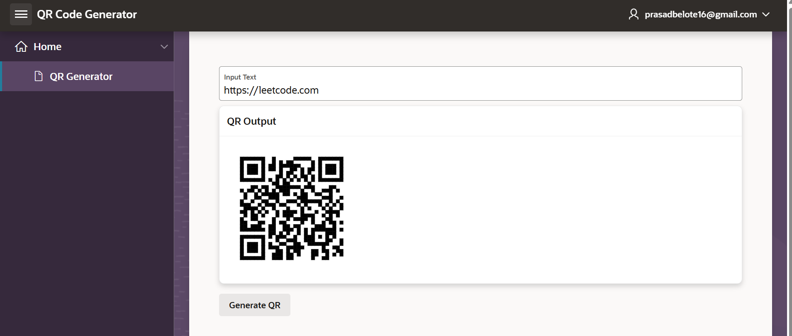

# Oracle APEX QR Code Generator

This project demonstrates how to generate QR codes dynamically using Oracle APEX built-in package `APEX_BARCODE`.

## 🔧 Features
- Dynamic QR Code generation
- Built using Oracle APEX
- No external APIs used



## 🧠 How it works

```plsql
DECLARE
    l_qr CLOB;
BEGIN
    l_qr := apex_barcode.get_qrcode_svg(
        p_value => :P2_INPUT_TEXT,
        p_size  => 200
    );

    RETURN l_qr;
END;
